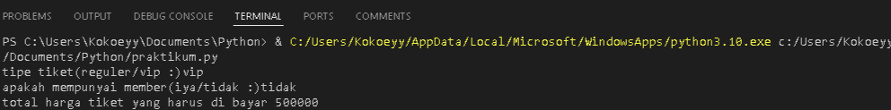

## Kode Program
``` python 
reguler = 100000
vip =  500000
discount = 0.2

tipe_tiket = input("tipe tiket(reguler/vip :)")
status_member = input("apakah mempunyai member(iya/tidak :)")

if tipe_tiket == 'reguler' :
    harga_tiket = reguler
elif tipe_tiket == 'vip' :
    harga_tiket = vip
else :
    print('tiket tidak valid')
    exit()
    
if status_member == 'iya' :
    harga_tiket = harga_tiket - (harga_tiket * discount)
    
print(f'total harga tiket yang harus di bayar {harga_tiket}')
```

## Contoh Output Program




